# GridWorld阶段1自学报告

17343064 李僖哲

- vi/vim

  vim就相当于是一个文本编辑器，它的功能十分之强大，通过本次学习，我了解到以下内容：

  1. 它有三种模式：

     - 命令模式：这也是vim的默认模式，可以复制行，删除行
     - 输入模式：可以输入文本内容
     - 末行模式：可以输入很多管理员命令

     各种模式之间也有切换的方式：

     - 命令->输入：输入`shift +i`就可以插入文本了
     - 输入->命令：输入`ESC`
     - 命令->末行：输入`:`
     - 末行->命令：输入`ESC`

  2. 打开文件

     一般的文件输入`vim filename`就可以进入编辑器了，但是如果该文件需要管理员权限的话就需要使用`sudo vim filename`

     比如这两天实训用到多次的`/etc/profile`，打开之后是这样的

     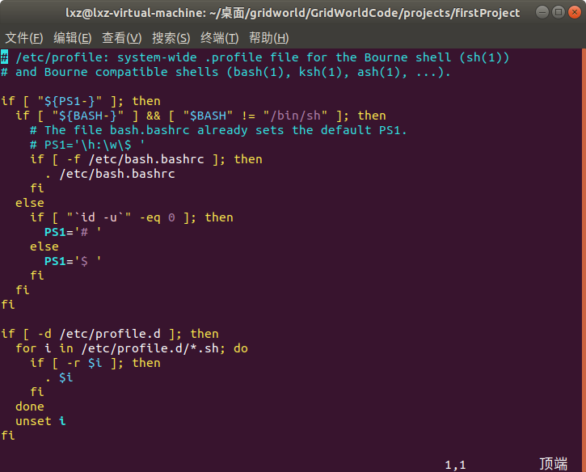

  3. 关闭文件

     阅读或者编辑完成之后我们需要退出编辑器，我们需要先进入命令模式，也就是按下`ESC`键，再进入末行模式，按下`:`，根据需要输入不同的命令进行退出：

     - q：没有编辑文件，直接退出
     - wq：编辑文件之后保存退出
     - q!：编辑文件了，但是不想保存，强制退出

- java

  java之前学过一点，所以这一次大致上就是复习以下，首先需要配置环境

  在网上下载需要的jdk后，放到某个路径中，然后添加环境变量

  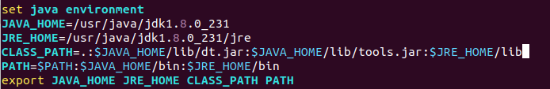

  

  为了熟悉，写了一个`helloworld`

  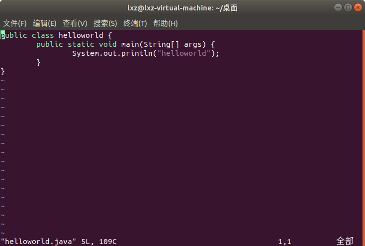

  编译运行结果如下：

  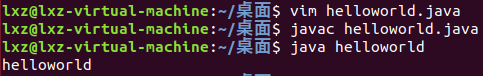

  然后就开始上网查阅资料学习如何写一个简单的计算器

  由于对java的GUI不是很了解，所以上手有点困难，阅读了一些资料之后稍微有了一点思路：

  - 整体框架使用一个`GridLayout`来排版
  - 运算符号以及确认键用`JButton`实现
  - 左右操作数用`JTextField`实现
  - 报错信息用`JFrame`实现

  

  首先需要将这些控件进行初始化

  ```java
  Container show = getContentPane();
  show.setLayout(new GridLayout(2, 5));
  allButtons = new JButton[8];
  
  allButtons[0] = new JButton(""); // show operator
  allButtons[1] = new JButton("=");
  allButtons[2] = new JButton(""); // show answer
  allButtons[3] = new JButton("+");
  allButtons[4] = new JButton("-");
  allButtons[5] = new JButton("*");
  allButtons[6] = new JButton("/");
  allButtons[7] = new JButton("OK");
  
  operationLeft = new JTextField(5);
  operationLeft.setHorizontalAlignment(JTextField.CENTER);
  operationRight = new JTextField(5);
  operationRight.setHorizontalAlignment(JTextField.CENTER);
  ```

  

  然后因为前三个`Button`不需要点击事件，所以需要设置它们的属性

  ```java
  for (int i = 0; i < 3; ++i) {
      allButtons[i].setEnabled(false);
  }
  ```

  

  接下来就将这些空间一一添加到`GridLayout`中

  ```java
  show.add(operationLeft);
  show.add(allButtons[0]);
  show.add(operationRight);
  for (int i = 1; i < 8; ++i) {
      show.add(allButtons[i]);
  }
  ```

  

  最后就是添加点击事件，获取用户的输入

  首先是左右操作数的设置，这里只允许输入数字，但一不小心把小数给忽略了

  ```java
  private void addOperationListeners() {
      operationLeft.addKeyListener(new KeyAdapter() {
          public void keyTyped(KeyEvent e) {
              int keyChar = e.getKeyChar();				
              if (keyChar >= KeyEvent.VK_0 && keyChar <= KeyEvent.VK_9){
                  return;
              } else {
                  e.consume(); //屏蔽掉非数字输入
              }
          }
      });
      ...
      // 右操作数是类似的
  }
  ```

  

  然后是获取运算符

  ```java
  private void addOperatorListeners() {
      allButtons[3].addActionListener(new ActionListener() {
  
          public void actionPerformed(ActionEvent e) {
              allButtons[0].setText(allButtons[3].getText());
          }
      });
  	...
      // 这是加号的获取方式，其它三个是类似的
  }
  ```

  

  最后是OK键的点击事件，关键的一点就是除法中不能出现除数为0的现象，所以需要特别注意除法运算。我这里对于除数为0的情况进行了特殊的考虑，如果用户输入的运算为除法而且除数为0的话会弹出一个对话框，这个对话框使用`JFrame`实现，提示用户“除数不能为0”

  ```java
  private void addOKListeners() {
      allButtons[7].addActionListener(new ActionListener() {
  
          public void actionPerformed(ActionEvent e) {
              double ans;
              double left = Double.parseDouble(operationLeft.getText());
              double right = Double.parseDouble(operationRight.getText());
              String sign = allButtons[0].getText();
              if (sign.equals("+")) {
                  ans = left + right;
              } else if (sign.equals("-")) {
                  ans = left - right;
              } else if (sign.equals("*")) {
                  ans = left * right;
              } else {
                  if (right == 0) {
                      ans = 0;
                      JFrame jFrame = new JFrame("Wrong Message");
                      Container container = jFrame.getContentPane();
                      JLabel jLabel = new JLabel("除数不能为零！");
                      container.add(jLabel);
                      jFrame.setVisible(true);
                      jFrame.setSize(300, 150);
                  } else {
                      ans = left / right;
                  }
              }
              allButtons[2].setText(ans + "");
          }
      });
  }
  ```

  

  最后的效果如下：

  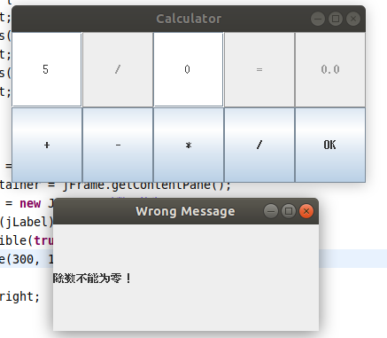

  

- ant

  ant其实就是`C++`下的`MakeFile`，是java语言的开发工具，使用ant工具可以容易的维护和编写代码，简单之余文件结构还很清晰。

  首先需要配置ant环境，在网上下载安装包之后，将它放到某个路径之下，然后添加环境变量就可以了

  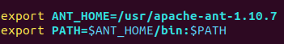

  然后开始编写`.xml`文件，先介绍以下一些属性的含义：

  - `property`标签的作用是在build.xml文件中声明一些常用的变量。
  - `path`标签保存的是某个文件夹的路径。
  - `project`标签是构建文件的根标签。它可以有多个内在属性，就如代码中所示，其各个属性的含义分别如下
    1. default表示默认的运行目标，这个属性是必须的
    2. basedir表示项目的基准目录
    3. name表示项目名
  - `target`标签一个项目标签下可以有一个或多个target标签。Target的所有属性如下
    1. name表示标明，这个属性是必须的
    2. depends表示依赖的目标
    3. if表示仅当属性设置时才执行
    4. unless表示当属性没有设置时才执行
  - `mkdir`标签该标签用于创建一个目录，它有一个属性dir用来指定所创建的目录名
  - `jar`标签该标签用来生成一个JAR文件，其属性如下
    1.  destfile表示JAR文件名
    2. basedir表示被归档的文件名
    3. includes表示被归档的文件模式
    4. exchudes表示被排除的文件模式。
  - `javac`标签该标签用于编译一个或一组java文件，其属性如下
    1. srcdir表示源程序的目录
    2. destdir表示class文件的输出目录
    3. include表示被编译的文件的模式
    4. excludes表示被排除的文件的模式
    5. classpath表示所使用的类路径
    6. debug表示包含的调试信息
    7. optimize表示是否使用优化
    8. verbose 表示提供详细的输出信息
    9. fileonerror表示当碰到错误就自动停止
  - `java`标签该标签用来执行编译生成的.class文件，其属性如下
    1. classname 表示将执行的类名
    2. jar表示包含该类的JAR文件名
    3. classpath所表示用到的类路径
    4. fork表示在一个新的虚拟机中运行该类
    5. failonerror表示当出现错误时自动停止
    6. output 表示输出文件
    7. append表示追加或者覆盖默认文件
  - `delete`标签该标签用于删除一个文件或一组文件，其属性如下
    1. /file表示要删除的文件
    2. dir表示要删除的目录
    3. includeEmptyDirs 表示指定是否要删除空目录，默认值是删除
    4. failonerror 表示指定当碰到错误是否停止，默认值是自动停止
    5. verbose表示指定是否列出所删除的文件，默认值为不列出

  然后就开始测试我的`HelloWorld`了。

  在`.xml`文件所在路径输入`ant`，结果如下：

  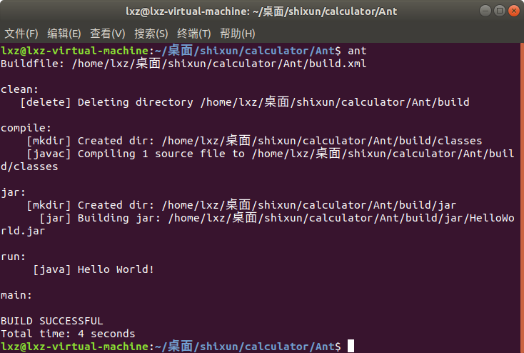

  可以看到编译信息和运行信息，成功输出了`Hello World`

  

- Junit

  同样需要先配置环境，在网上下载`Junit`的压缩包，解压之后需要添加环境变量

  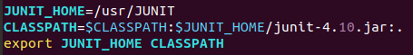

  然后为`HelloWorld`写一个`TestRunner`

  ```java
  import org.junit.runner.JUnitCore;
  import org.junit.runner.Result;
  import org.junit.runner.notification.Failure;
  
  public class HelloWorldTestRunner {
  	public static void main(String[] args) {
  		Result result = JUnitCore.runClasses(HelloWorld.class);
  		for (Failure failure : result.getFailures()) {
  			System.out.println(failure.toString());
  		}
  		System.out.println(result.wasSuccessful());
  	}
  }
  ```

  利用ant进行编译之后，在运行生成的文件，输出如下：

  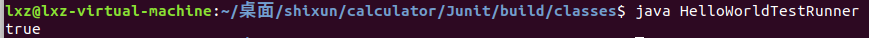

  

- Sonar

  利用TA上传的`sonar-3.7.4`和`sonar-runner-2.4`的文件进行测试。

  注意不要把这两个文件放在`/usr`文件夹里面，会导致没有权限运行，一个坑

  我把这两个文件夹放在桌面上，然后开始配置环境变量

  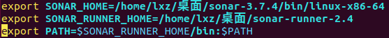

  然后进入`$SONAR_HOME`所在目录，在终端中输入`./sonar.sh start`启动服务

  写好`sonar-project.properties`之后，在终端中输入`sonar-runner`后访问`localhost:9000`查看结果，注意服务启动需要一点时间

  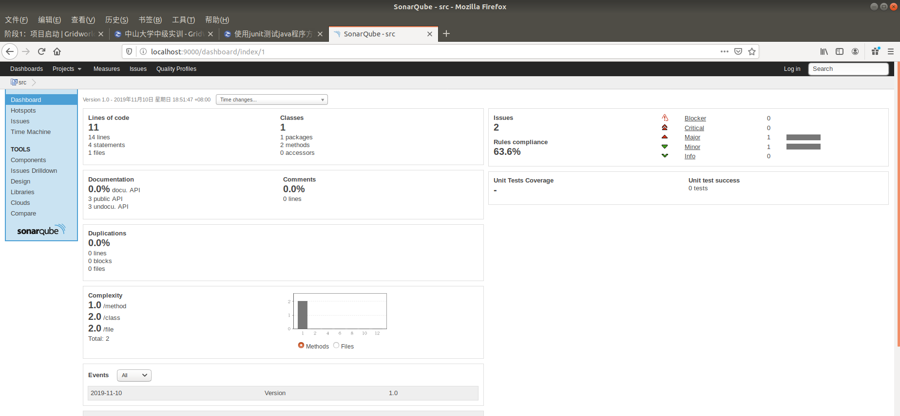